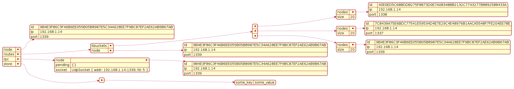

# kademlia-dht

Simple implementation of the Kademlia DHT protocol in Rust with state dumping features.

## Table of contents

-   [kademlia-dht](#kademlia-dht)
    -   [Lib structure](#lib-structure)
    -   [Usage](#usage)
        -   [Interface creation](#interface-creation)
        -   [Main operations](#main-operations)
            -   [PUT](#put)
            -   [GET](#get)
    -   [Example program](#example-program)
    -   [Documentation](#documentation)
        -   [Kademlia node](#kademlia-node)
            -   [Node::new](#nodenew)
            -   [get_info](#get_info)
            -   [get_addr](#get_addr)
        -   [256bits Key and Distance](#256bits-key-and-distance)
            -   [Key::new](#keynew)
            -   [Distance::new](#distancenew)
        -   [Routing Table](#routing-table)
            -   [Routing::new](#routingnew)
            -   [get_lookup_bucket_index](#get_lookup_bucket_index)
            -   [contact_via_rpc](#contact_via_rpc)
            -   [update](#update)
            -   [remove](#remove)
            -   [get_closest_nodes](#get_closest_nodes)
        -   [Network](#network)
            -   [Request](#request)
            -   [Response](#response)
            -   [Message](#message)
            -   [RpcMessage](#rpcmessage)
            -   [Rpc::new](#rpcnew)
            -   [Rpc::open](#rpcopen)
            -   [send_msg](#send_msg)
            -   [handle_response](#handle_response)
            -   [make_request](#make_request)
        -   [Kademlia interface creation](#kademlia-interface-creation)
            -   [Protocol::new](#protocolnew)
            -   [rt_forwarder](#rt_forwarder)
            -   [request_handler](#request_handler)
            -   [craft_res](#craft_res)
            -   [reply](#reply)
            -   [Kademlia API](#kademlia-api)
            -   [nodes_lookup](#nodes_lookup)
            -   [value_lookup](#value_lookup)
            -   [put](#put)
            -   [get](#get)
    -   [State dumping](#state-dumping)
    -   [Implemented features](#implemented-features)
    -   [Missing features](#missing-features)
    -   [Enhancements](#enhancements)
    -   [References](#references)

## Lib structure

```
src/
  key.res       ---> Implementation of the 256bits unique ID
  node.rs       ---> Node struct definition
  network.rs    ---> Network module used to issue RPCs
  routing.rs    ---> Routing Table implementation using vectors
  protocol.rs   ---> Main library API
  utils.rs      ---> General utilities functions
  main.rs       ---> Example program
  lib.rs        ---> Main lib file
```

## Usage

### Interface creation

In order to join the network you must create an interface with the `Protocol::new` method:

```rust
// BRAND NEW NETWORK
// if you want you can explicitely create a node first
let root = Node::new(utils::get_local_ip().unwrap(), 8080);

// it needs an IP, a PORT and an Option<Node> (bootstrap node)
let root_interface = Protocol::new(root.ip.clone(), root.port.clone(), None);
```

If you want to join a network and you already know a peer you can provide it as a `bootstrap` node:

### Main operations

These are the main operations, there are more methods you can use but these are the ones you probably need (see [Docs](##Documentation) for more).

#### PUT

Store a `<key, value>` pair in the network:

```rust
// interface is already defined
interface.put("some_key", "some_value");
```

#### GET

Retreive a value from the network given its key:

```rust
// interface is already defined
let value = interface.get("some_key"); // some_value
```

```rust
// this is the contact we already know
let root = Node::new(utils::get_local_ip().unwrap(), 8080);

let our_node = Node::new(utils::get_local_ip().unwrap(), 8081);
let our_interface = Protocol::new(our_node.ip, our_node.port, Some(root.clone())));
```

## Example program

I've written an example program to test the lib out. In order to run it issue the following command:

```
cargo run
```

It will spin up 10 nodes and it will test the `PUT` and the `GET` method.

If you want to run tests, issue:

```
cargo test
```

## Documentation

### Kademlia node

A node is a struct containing an IP, a PORT and a unique ID of type `Key` (see `key.rs`).

The `node.rs` module exposes the following methods:

#### Node::new

Creates a node on a given address and port

```rust
let node = Node::new("192.168.1.10", 8080);
```

We can also use this `utils.rs` method to automatically grab the local address:

```rust
use kademlia_dht::utils;

let node = Node::new(utils::get_local_ip().unwrap(), 8080);
```

#### get_info

Returns a string containing the IP, PORT and ID of the given node:

```rust
let node = Node::new(utils::get_local_ip().unwrap(), 8080);

printl!("node: {}", node.get_info()); // 192.168.1.10:8080:<SOME_256bits_ID>
```

#### get_addr

Returns a string containing the IP and the PORT of the given node. See [get_info](####get_info) for similar behavior.

### 256bits Key and Distance

Both a `Key` and a `Distance` are struct wrappers around a `[u8]` slice of `KEY_LEN` length (32 bytes, 256bits).

The `key.rs` module provides methods to create a 256bits `unique ID` and to calculate the distance (**XOR**) between two IDs.

#### Key::new

```rust
let key = Key::new("some string".to_string());
```

#### Distance::new

Caluclates the distance between two `Key`s.

```rust
// for example, to calculate the distance between 2 nodes

let node0 = Node::new(utils::get_local_ip().unwrap(), 1335);
let node1 = Node::new(utils::get_local_ip().unwrap(), 1336);

let dist = Distance::new(&node0.id, &node1.id); // as we know, the id field is of type Key
```

### Routing Table

The routing table is a struct containing a `node` fields, representing the current node instance, a `kbuckets` field which is a `Vec` of `KBucket` (a struct containing a `Vec` of nodes and a size field) and a _crossbeam_channel_ `sender` and `receiver`(external crate used to communicate with other modules).

The routing table communicates with the `protocol.rs` module for some actions such as _pinging_ nodes that must be checked. The following struct (coming from `utils.rs`) is used in the _crossbeam_channel_:

```rust
pub enum ChannelPayload {
    Request((network::Request, Node)),
    Response(network::Response),
    NoData,
}
```

Through the channel we can see a `Request`, a `Response` or `NoData` if the contacted peer doesn't reply to the messages coming from the routing table.

For more information about `Request` and `Response` see the [Network module](###Network).

#### Routing::new

Creates a new routing table:

```rust
pub fn new(
    node: Node, // current node
    bootstrap: Option<Node>, // bootstrap node
    sender: crossbeam_channel::Sender<ChannelPayload>, // sender of type ChannelPayload
    receiver: crossbeam_channel::Receiver<ChannelPayload>, // receiver of type ChannelPayload
) -> Self
```

#### get_lookup_bucket_index

Gets the corresponding bucket index for a given node ID:

```rust
fn get_lookup_bucket_index(&self, key: &Key) -> usize
```

#### contact_via_rpc

Method used to communicate internally with the `protocol.rs` module. Used to send `Ping`s to other nodes:

```rust
fn contact_via_rpc(&self, dst: Node) -> bool
```

Here we use the _crossbream_channel_.

#### update

Inserts a given node into the routing table. If there's space for it the node gets pushed to the vector, otherwise the necessary checks are performed on the other nodes (see official paper for more details).

```rust
pub fn update(&mut self, node: Node)
```

#### remove

Removes a given node from the routing table:

```rust
pub fn remove(&mut self, node: &Node)
```

#### get_closest_nodes

In this method the `NodeAndDistance` struct is used, which is a tuple of a `Node` and a `Distance`.

Returns a Vector of `NodeAndDistance` for a given `Key` target:

```rust
pub fn get_closest_nodes(&self, key: &Key, count: usize) -> Vec<NodeAndDistance> {
```

### Network

The `network.rs` module provides methods to communicate to other network nodes. Here we issue `RPCs` (Remote Procedure Calls) through the `Rpc` struct.

The `Rpc` contains a _socket_ field which is `Arc` to a `std::net::UdpSocket`, a _pending_ field which is a `Arc` `Mutex` around a `HashMap` of `Key`s and `mpsc::Sender<Option<Response>>` and a _node_ field representing the current node.

```rust
pub struct Rpc {
    pub socket: Arc<UdpSocket>,
    pub pending: Arc<Mutex<HashMap<Key, mpsc::Sender<Option<Response>>>>>,
    pub node: Node,
}
```

#### Request

Enum around Kademlia RPCs.

```rust
pub enum Request {
    Ping,
    Store(String, String),
    FindNode(Key),
    FindValue(String),
}
```

#### Response

```rust
pub enum Response {
    Ping,
    FindNode(Vec<NodeAndDistance>),
    FindValue(FindValueResult),
}
```

Where `FindValueResult` comes from `routing.rs` and it wraps either a vector of `NodeAndDistance` or the `String` value that we had looked for.

#### Message

```rust
pub enum Message {
    Abort,
    Request(Request),
    Response(Response),
}
```

#### RpcMessage

This is what gets sent to other network nodes.

```rust
pub struct RpcMessage {
    pub token: Key, // token of the message, crafted from source addr and timestamp
    pub src: String,
    pub dst: String,
    pub msg: Message,
}
```

#### Rpc::new

Creates a new RPC around a node without starting communications:

```rust
pub fn new(node: Node) -> Self
```

#### Rpc::open

Starts listening and sending modes:

```rust
pub fn open(rpc: Rpc, sender: mpsc::Sender<ReqWrapper>) {
```

Where `ReqWrapper` is a wrapper around the `Request` enum, used to keep track of metadata about the request (who sent it):

```rust
pub struct ReqWrapper {
    pub token: Key,
    pub src: String,
    pub payload: Request,
}
```

In this method, as soon as we receive a request we send that through the channel to the `protocol.rs` module, which handles it.

#### send_msg

Forwards a `RpcMessage` to another node using the `UdpSocket`:

```rust
pub fn send_msg(&self, msg: &RpcMessage)
```

#### handle_response

Method used to handle incoming responses from other nodes:

```rust
pub fn handle_response(self, token: Key, res: Response)
```

Here we keep track of the `pending` HashMap.

#### make_request

Makes a `Request` to a `dst` node that is then forwared to the `protocol.rs` module, also waits for the corresponding `Response` from the contacted node. It also handles the `pending` HashMap

```rust
pub fn make_request(&self, req: Request, dst: Node) -> mpsc::Receiver<Option<Response>> {
```

### Kademlia interface creation

The interface has the following structure:

```rust
pub struct Protocol {
    pub routes: Arc<Mutex<routing::RoutingTable>>,
    pub store: Arc<Mutex<HashMap<String, String>>>,
    pub rpc: Arc<network::Rpc>,
    pub node: Node,
}
```

It includes the routing table, the store (HashMap used to store `<key, value>` pairs), the rpc coming from the network module and the current active node.

The `protocol.rs` module exposes the following methods:

#### Protocol::new

```rust
pub fn new(ip: String, port: u16, bootstrap: Option<Node>) -> Self
```

Creates an interface to use Kademlia on a given address and port. A `bootstrap` node is a node that we already know in the network.

**With bootstrap node**:

```rust
// some already existing node
let root = Node::new("192.168.1.10", 8080);

// cloning the node it's not mandatory
let root_interface = Protocol::new("192.168.1.10".to_string(), 8081, Some(root.clone()));
```

**Without bootstrap node**:

```rust
let interface = Protocol::new("192.168.1.10", 8080, None);
```

In this method we also establish communications with the `routing.rs` module and the `network.rs` one by using channels, after of course creating them.

#### rt_forwarder

Used internally to forward requests issued by the Routing table:

```rust
fn rt_forwarder(
    self,
    sender: crossbeam_channel::Sender<utils::ChannelPayload>,
    receiver: crossbeam_channel::Receiver<utils::ChannelPayload>,
) {
```

#### request_handler

Used to handle incoming requests thorugh the `mpsc` channel. Here we send (see [reply](####reply)) responses to the requests.

```rust
fn requests_handler(self, receiver: mpsc::Receiver<network::ReqWrapper>) {
```

#### craft_res

Simply crafts responses for requests and executes `RPCs` coming from those requests (this means that we mutate the routing table and the store).

```rust
fn craft_res(&self, req: network::ReqWrapper) -> (network::Response, network::ReqWrapper) {
```

#### reply

Used to reply to requests. Calls `send_msg`.

```rust
fn reply(&self, packet_details: (network::Response, network::ReqWrapper)) {
```

#### Kademlia API

Here there are the implementations for the needed API calls:

```rust
pub fn ping(&self, dst: Node) -> bool // pings a node, returns true in case of response

pub fn store(&self, dst: Node, key: String, val: String) -> bool // rpc to store a <key, value> pair on a given destination. Returns true in case of response


pub fn find_node(
    &self,
    dst: Node,
    id: super::key::Key,
) -> Option<Vec<routing::NodeAndDistance>> // finds a node given the current node id. Returns a NodeAndDistance struct for that node or None in case it doesnt get a response


pub fn find_value(&self, dst: Node, k: String) -> Option<routing::FindValueResult> // finds a given value using the provided key on a given node. Returns a FindValueResult or None in case it doesnt get a response
```

#### nodes_lookup

Method used to lookup nodes given a starting ID.

```rust
pub fn nodes_lookup(&self, id: &super::key::Key) -> Vec<routing::NodeAndDistance> {
```

#### value_lookup

Method used to lookup a value given a `String` key:

```rust
pub fn value_lookup(&self, k: String) -> (Option<String>, Vec<routing::NodeAndDistance>) {
```

#### put

Method used to `put` a `<key, value>` pair into the network. It calls `nodes_lookup` and `store`.

```rust
pub fn put(&self, k: String, v: String)
```

#### get

Method used to extract a value from the network given a key. It calls `value_lookup` but also `store`.

```rust
pub fn get(&self, k: String) -> Option<String>
```

## State dumping

There are two `utils.rs` methods used to dump the internal state of a Kademlia node:

```rust
pub fn dump_interface_state(interface: &Protocol, path: &str)
```

Dumps the `Protocol` object to a given file path (**must be** `dumps/<name>.json`, where you choose `name`). It dumps it as `json` and as `plantuml`.

Here's an example of the rendered dump using PlantUML:



```rust
pub fn dump_node_and_distance(
    entries: &Vec<NodeAndDistance>,
    target: &super::key::Key,
    path: &str,
) {
```

Dumps a vector of `NodeAndDistance`s in `json` format. Example:

```json
{
    "found": [
        {
            "distance": "00000000000000000000000000000000",
            "node": {
                "id": "9278733FBB7F4C6914839C98A54912F4F18B3F15EAED15178663AA5FC63",
                "ip": "192.168.1.10",
                "port": 1339
            }
        },
        {
            "distance": "3D0C24670ACCA14C1DEE576D7AF2D85486F125E4E0BFD664CCDABA9E532ED2",
            "node": {
                "id": "342BA354F17B558A8CA66EA4F0A6497BC9E99615BE11735CBD2DCA4F6D2B1",
                "ip": "192.168.1.10",
                "port": 1338
            }
        },
        {
            "distance": "B8F339EA9FB5DECF23F9C7D754476AD9C6698AC5787281EF371456C766F96C88",
            "node": {
                "id": "B1F14199A0EA18325688FEE9DCD3E48E9269276892C2F3E66135EA15C5C90EB",
                "ip": "192.168.1.10",
                "port": 1337
            }
        }
    ],
    "target": "9278733FBB7F4C6914839C98A54912F4F18B3F15EAED15178663AA5FC63"
}
```

## Implemented features

Features specified in the paper that are implemented in this lib

-   [x] Keys
-   [x] XOR Distance between Keys
-   [x] KBuckets

    -   represented as a `Vec` of `Vec`s. A max of 256 kbuckets is set, each of them containing up to 20 elements

-   [x] PING
-   [x] STORE
-   [x] FIND_NODE
-   [x] FIND_VALUE
-   [x] Node lookup
-   [x] Republishing of `<key, value>` pairs every hour

    -   [ ] technically, the original publisher should republish ever 24 hours

-   [x] ability to dump a node internal state to `JSON` and `plantuml`
-   [x] ability to dump distances between nodes to `JSON`

## Missing features

-   [ ] expiration date on `<key, value>` pairs

    -   this isn't wanted when kademlia is used in a decentralized storage system

-   [ ] replicate closest `<key, value>` pairs when a node joins the network

-   [ ] if no lookup has been performed for an hour in a `kbucket`, that bucket must be refreshed

## Enhancements

-   [ ] better nodes lookup algorithm, as described in the paper

## References

-   Kademlia: A Peer-to-peer Information System
    Based on the XOR Metric by Petar Maymounkov and David Mazières [PDF](https://citeseerx.ist.psu.edu/viewdoc/download?doi=10.1.1.18.6160&rep=rep1&type=pdf)

-   Implementation of the Kademlia Distributed Hash Table by Bruno Spori [PDF](https://pub.tik.ee.ethz.ch/students/2006-So/SA-2006-19.pdf)

-   Kademlia: A Design Specification by XLattice project [PDF](http://xlattice.sourceforge.net/components/protocol/kademlia/specs.pdf)

-   TinyTorrent: Implementing a Kademlia Based DHT
    for File Sharing by Sierra Kaplan-Nelson, Jestin Ma, Jake Rachleff [PDF](https://www.scs.stanford.edu/17au-cs244b/labs/projects/kaplan-nelson_ma_rachleff.pdf)
